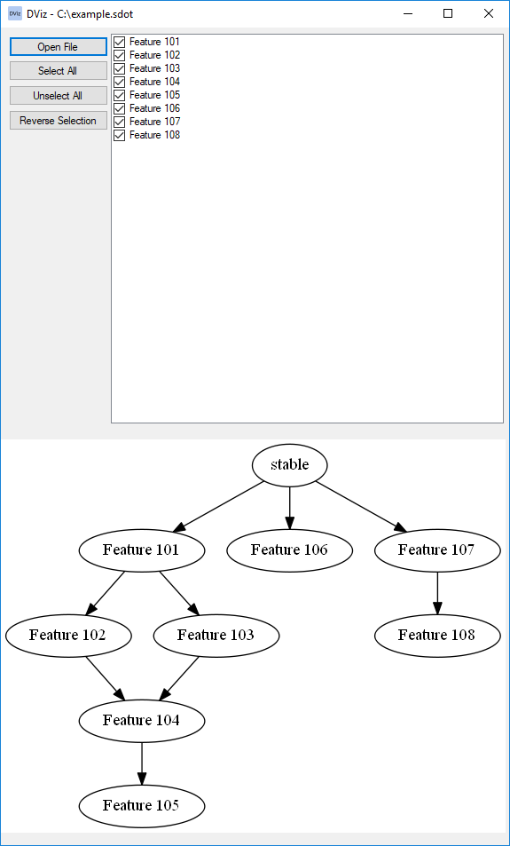
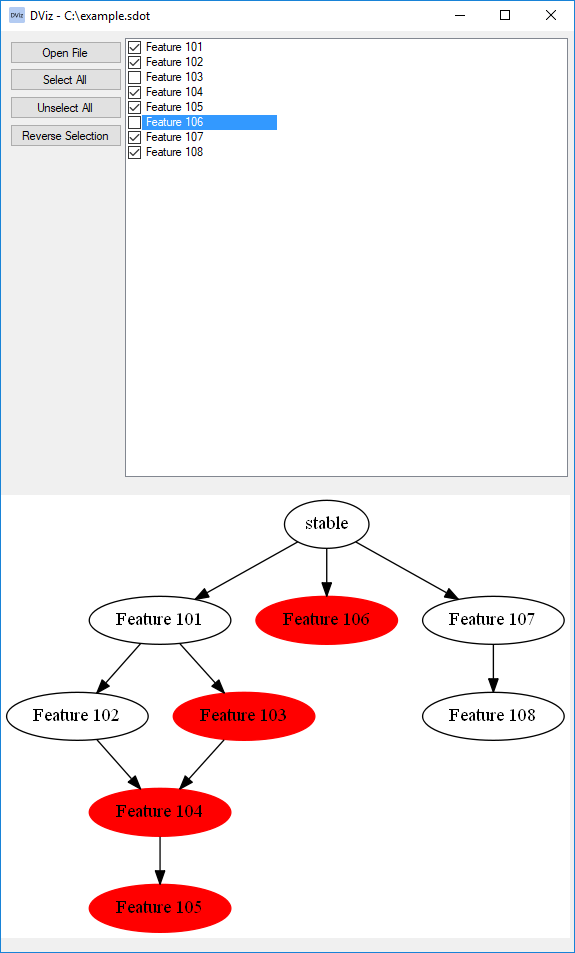

# DViz

DViz is a simple dependency visualizer, where dependencies can be expressed in a very simple text-based language and then visualized in a graphical UI.

# Background and usage

During my work as a developer, I have to take on some responsibilities of what is known as DevOps.

Part of that is the documentation and tracking of feature dependencies to draw a clear picture for the product owner when they need to decide which features are to be released, and part of that is howing what features are dependent on each other.

## Example

During the development of a software product, a stable version was released and then the team added features numbered 101 through 108.

The dependencies between these features are described in a plain text file using the `SimpleDot` language and can be checked in to source control, example:

```
Feature 101 -> Feature 102
Feature 101 -> Feature 103
Feature 102 -> Feature 104
Feature 103 -> Feature 104
Feature 104 -> Feature 105
Feature 106
Feature 107 -> Feature 108
```

This screenshot shows what `DViz` displays when the file with previous content is loaded:



Unchecking `Feature 103` and `Feature 106` will highlight the features and their dependents in red, DViz is suggesting that not releasing these two features will mean that `Feature 104` and `Feature 105` also cannot be released as they depend on `Feature 103` directly or indirectly.



# Technologies used

This tool is written using C# 6.0 as a Windows Forms application on .NET 4.6.1.

The language used for defining dependencies is created as part of this tool and is called `SimpleDot`, which borrows the edge notation from [`Dot`](http://www.graphviz.org/content/dot-language).

The graphical rendering relies on the open source tool [Graphviz](http://www.graphviz.org/) built by [many researchers](http://www.graphviz.org/Credits.php) which is can be downloaded from [the Graphviz website](http://www.graphviz.org/Download..php) and also can be found inside the [Graphviz](./Graphviz) folder in this repository.

To make the use of Graphviz easier in C#, I used [GraphViz-C-Sharp-Wrapper](https://github.com/JamieDixon/GraphViz-C-Sharp-Wrapper) by [Jamie Dixon](https://github.com/JamieDixon), which is avaliable as a [NuGet package](https://www.nuget.org/packages/GraphViz.NET/).